# AudioOverviewGraph Agent Flowchart

This flowchart visualizes the execution flow of the AudioOverviewGraph agent, which generates podcast-style audio overviews from educational content through a map-reduce pattern with dialogue script generation and text-to-speech synthesis.

## Flow Diagram

```mermaid
flowchart TD
    START([Start]) --> RouteToMap[routeToMap<br/>Route to Map Phase]
    
    RouteToMap --> CheckChunks{Chunks<br/>Available?}
    
    CheckChunks -->|No Chunks| Collapse1[collapse<br/>Skip to Collapse]
    CheckChunks -->|Has Chunks| ValidateChunks[Validate & Pack Chunks<br/>Target: 15K chars/chunk]
    
    ValidateChunks --> FanOut[Fan-Out: Create Send Objects<br/>for Parallel Processing]
    
    FanOut --> ExtractBeats1[extract_beats<br/>Chunk 1<br/>Fast LLM]
    FanOut --> ExtractBeats2[extract_beats<br/>Chunk 2<br/>Fast LLM]
    FanOut --> ExtractBeatsN[extract_beats<br/>Chunk N<br/>Fast LLM]
    
    ExtractBeats1 --> GenerateBeats1[Generate Dialogue Beats<br/>Audio Type Specific<br/>Text Format]
    ExtractBeats2 --> GenerateBeats2[Generate Dialogue Beats<br/>Audio Type Specific<br/>Text Format]
    ExtractBeatsN --> GenerateBeatsN[Generate Dialogue Beats<br/>Audio Type Specific<br/>Text Format]
    
    GenerateBeats1 --> CheckError1{Generation<br/>Successful?}
    GenerateBeats2 --> CheckError2{Generation<br/>Successful?}
    GenerateBeatsN --> CheckErrorN{Generation<br/>Successful?}
    
    CheckError1 -->|Success| CollectMapOutputs[Collect All Map Outputs<br/>Dialogue Beats Text]
    CheckError1 -->|Error| Fallback1[Return Fallback Text<br/>Error Message]
    CheckError2 -->|Success| CollectMapOutputs
    CheckError2 -->|Error| Fallback2[Return Fallback Text<br/>Error Message]
    CheckErrorN -->|Success| CollectMapOutputs
    CheckErrorN -->|Error| FallbackN[Return Fallback Text<br/>Error Message]
    
    Fallback1 --> CollectMapOutputs
    Fallback2 --> CollectMapOutputs
    FallbackN --> CollectMapOutputs
    
    CollectMapOutputs --> Collapse2[collapse<br/>Recursive Collapse]
    Collapse1 --> Collapse2
    
    Collapse2 --> RecursiveCollapse[recursiveCollapse<br/>Group by Token Budget]
    
    RecursiveCollapse --> CheckCollapseSize{Still<br/>Too Large?}
    
    CheckCollapseSize -->|Yes| BatchCollapse[Batch Collapse<br/>Join with Separators]
    CheckCollapseSize -->|No| WriteScript[write_script<br/>Generate Dialogue Script]
    
    BatchCollapse --> CheckCollapseSize
    
    WriteScript --> CalculateChunks[Calculate Dialogue Chunks<br/>30 lines per chunk]
    
    CalculateChunks --> InitializeTracking[Initialize Example Tracking<br/>Prevent Repetition]
    
    InitializeTracking --> GenerateChunk1[Generate Dialogue Chunk 1<br/>Smart LLM<br/>JSON Array Output]
    
    GenerateChunk1 --> ExtractExamples1[Extract Examples from Chunk<br/>Track Covered Examples]
    
    ExtractExamples1 --> GenerateChunk2[Generate Dialogue Chunk 2<br/>Include Covered Examples<br/>Previous Dialogue Context]
    
    GenerateChunk2 --> ExtractExamples2[Extract Examples from Chunk<br/>Track Covered Examples]
    
    ExtractExamples2 --> GenerateChunkN[Generate Dialogue Chunk N<br/>Include Covered Examples<br/>Previous Dialogue Context]
    
    GenerateChunkN --> ExtractExamplesN[Extract Examples from Chunk<br/>Track Covered Examples]
    
    ExtractExamplesN --> ValidateScript{Script<br/>Generated?}
    
    ValidateScript -->|No Script| FallbackScript[Generate Fallback Script<br/>Error Message]
    ValidateScript -->|Has Script| CheckScriptLength{Script Length<br/>>= 50% Target?}
    
    CheckScriptLength -->|Too Short| WarnShort[Log Warning<br/>Short Script]
    CheckScriptLength -->|Adequate| SynthesizeAudio[synthesize_audio<br/>Text-to-Speech]
    
    FallbackScript --> SynthesizeAudio
    WarnShort --> SynthesizeAudio
    
    SynthesizeAudio --> BatchTTS[Batch TTS Requests<br/>5 lines per batch]
    
    BatchTTS --> ProcessBatch1[Process Batch 1<br/>Deepgram TTS<br/>Select Voice by Speaker]
    BatchTTS --> ProcessBatch2[Process Batch 2<br/>Deepgram TTS<br/>Select Voice by Speaker]
    BatchTTS --> ProcessBatchN[Process Batch N<br/>Deepgram TTS<br/>Select Voice by Speaker]
    
    ProcessBatch1 --> StreamToBuffer1[Convert Stream to Buffer<br/>MP3 Format]
    ProcessBatch2 --> StreamToBuffer2[Convert Stream to Buffer<br/>MP3 Format]
    ProcessBatchN --> StreamToBufferN[Convert Stream to Buffer<br/>MP3 Format]
    
    StreamToBuffer1 --> CollectAudioBuffers[Collect All Audio Buffers<br/>Maintain Order]
    StreamToBuffer2 --> CollectAudioBuffers
    StreamToBufferN --> CollectAudioBuffers
    
    CollectAudioBuffers --> CheckSuccessRate{Success Rate<br/>>= 50%?}
    
    CheckSuccessRate -->|Too Many Failures| ThrowError[Throw Error<br/>Insufficient Audio]
    CheckSuccessRate -->|Adequate| ConcatenateAudio[Concatenate Audio Buffers<br/>Final MP3]
    
    ConcatenateAudio --> ReturnSuccess[Return Final State<br/>Status: completed]
    
    ThrowError --> END([End])
    ReturnSuccess --> END
    
    %% Styling
    classDef startEnd fill:#e1f5e1,stroke:#4caf50,stroke-width:2px
    classDef process fill:#e3f2fd,stroke:#2196f3,stroke-width:2px
    classDef decision fill:#fff3e0,stroke:#ff9800,stroke-width:2px
    classDef parallel fill:#f3e5f5,stroke:#9c27b0,stroke-width:2px
    classDef error fill:#ffebee,stroke:#f44336,stroke-width:2px
    classDef audio fill:#e8f5e9,stroke:#66bb6a,stroke-width:2px
    classDef dialogue fill:#fff9c4,stroke:#fbc02d,stroke-width:2px
    
    class START,END startEnd
    class RouteToMap,ValidateChunks,FanOut,Collapse2,RecursiveCollapse,BatchCollapse,WriteScript,CalculateChunks,InitializeTracking,SynthesizeAudio,BatchTTS,CollectAudioBuffers,ConcatenateAudio process
    class CheckChunks,CheckCollapseSize,CheckError1,CheckError2,CheckErrorN,ValidateScript,CheckScriptLength,CheckSuccessRate decision
    class ExtractBeats1,ExtractBeats2,ExtractBeatsN,GenerateBeats1,GenerateBeats2,GenerateBeatsN,CollectMapOutputs,GenerateChunk1,GenerateChunk2,GenerateChunkN,ProcessBatch1,ProcessBatch2,ProcessBatchN,StreamToBuffer1,StreamToBuffer2,StreamToBufferN parallel
    class Fallback1,Fallback2,FallbackN,FallbackScript,ThrowError error
    class SynthesizeAudio,BatchTTS,ProcessBatch1,ProcessBatch2,ProcessBatchN,StreamToBuffer1,StreamToBuffer2,StreamToBufferN,CollectAudioBuffers,ConcatenateAudio audio
    class WriteScript,GenerateChunk1,GenerateChunk2,GenerateChunkN,ExtractExamples1,ExtractExamples2,ExtractExamplesN dialogue
```



## Key Components

### 1. **Routing** (`routeToMap`)
- Validates and packs chunks (target: 15K chars/chunk)
- Creates Send objects for parallel processing or routes to collapse
- Logs audio type and length configuration

### 2. **Map Phase** (`extractBeats`) - Parallel Execution
- Processes each chunk independently using Fast LLM
- **Audio Type-Specific Prompts**:
  - **deep_dive**: Extracts dialogue beats (facts, significance, examples, debate angles, follow-ups)
  - **brief**: Extracts essential key takeaways
  - **critique**: Extracts strengths, weaknesses, techniques, suggestions
  - **debate**: Extracts conflicting viewpoints and evidence
- **Text-Based Output**: Returns bulleted lists of dialogue beats
- **Error Handling**: Returns fallback text on error, continues processing

### 3. **Collapse Phase** (`collapse`)
- **Recursive Collapse**:
  - Groups outputs by token budget (max outputs per collapse)
  - Simple batching: joins outputs with separators
  - No LLM synthesis (unlike ReportGraph)
- Continues until size is manageable

### 4. **Script Generation** (`writeScript`)
- **Chunked Generation**:
  - Generates dialogue in chunks (30 lines per chunk)
  - Avoids token limits for long scripts
  - Calculates number of chunks based on target length
- **Target Line Counts**:
  - **short**: 30 lines (~4 minutes, 600-650 words)
  - **default**: 65 lines (~7.5 minutes, 1200-1300 words)
  - **long**: 100 lines (~12.5 minutes, 2000-2200 words)
- **Anti-Repetition**:
  - Tracks covered examples (not concepts - concepts can have multiple aspects)
  - Includes covered examples in prompt for subsequent chunks
  - Includes recent dialogue for continuity
- **Host Personalities**:
  - **host_a (Asteria)**: Expert, knowledgeable, authoritative but accessible
  - **host_b (Orion)**: Curious interviewer, asks follow-ups, shows engagement
- **Natural Dialogue**:
  - 2-4 sentences per turn (15-40 words)
  - Includes thoughtful reactions and hesitation markers
  - Uses "..." for thoughtful pauses
  - Shows authentic intellectual engagement
- **JSON Parsing**:
  - Robust extraction: finds first '[' and last ']'
  - Validates structure (array with speaker/text fields)
  - Handles parsing errors gracefully
- **Example Extraction**:
  - Uses LLM to extract concrete examples from each chunk
  - Tracks examples to prevent repetition
  - Silently fails if extraction fails (optional step)

### 5. **Audio Synthesis** (`synthesizeAudio`)
- **Batched Processing**:
  - Processes 5 lines per batch (avoids overwhelming API)
  - Waits for each batch to complete before starting next
- **Voice Selection**:
  - **host_a**: Uses `VOICES.host_a` (Deepgram Aura model)
  - **host_b**: Uses `VOICES.host_b` (Deepgram Aura model)
  - Configurable via environment variables
- **TTS Processing**:
  - Uses Deepgram TTS API
  - Converts text to MP3 audio
  - Includes timeout protection (300s per line)
  - Handles individual line failures gracefully
- **Buffer Management**:
  - Converts ReadableStream to Buffer
  - Maintains original order of dialogue lines
  - Filters out failed lines
- **Success Validation**:
  - Requires >= 50% success rate
  - Throws error if too many failures
  - Concatenates successful audio buffers

## State Management

The agent uses `OverallState` with the following key fields:
- `chunks`: Input document chunks
- `audioType`: Type of audio (deep_dive, brief, critique, debate)
- `length`: Target length (short, default, long)
- `focus`: Optional topic focus area
- `mapOutputs`: Dialogue beats text from parallel processing
- `collapsedOutputs`: Consolidated beats from collapse phase
- `dialogueScript`: Final dialogue script (array of DialogueLine)
- `audioBuffer`: Final audio file (MP3 Buffer)
- `status`: Current processing status
- `progress`: Progress tracking for streaming

## Dialogue Line Schema

Each dialogue line follows the `DialogueLine` interface:
```typescript
{
  speaker: 'host_a' | 'host_b';  // Speaker identifier
  text: string;                   // Dialogue text (2-4 sentences)
}
```

## Audio Types

### Deep Dive
- **Focus**: Engaging podcast conversation
- **Extracts**: Core facts, significance, examples, debate angles, follow-ups
- **Format**: Bulleted lists with categories (Surprising Facts, Controversial Points, etc.)

### Brief
- **Focus**: Quick audio overview
- **Extracts**: Essential key takeaways, critical information
- **Format**: Concise bulleted list (Main Ideas, Quick Facts, Key Takeaways)

### Critique
- **Focus**: Expert review
- **Extracts**: Strengths, weaknesses, techniques, suggestions
- **Format**: Structured critique (Strengths, Weaknesses, Techniques, Suggestions)

### Debate
- **Focus**: Conflicting viewpoints
- **Extracts**: Arguments, gray areas, evidence
- **Format**: Debate material (Position A, Position B, Gray Areas, Key Evidence)

## Key Features

### Chunked Script Generation
- Generates dialogue in 30-line chunks
- Avoids token limits for long scripts
- Maintains continuity between chunks
- Tracks covered examples to prevent repetition

### Anti-Repetition Strategy
- **Tracks Examples**: Prevents repeating concrete examples/analogies
- **Allows Concept Variation**: Can discuss different aspects of same concept
- **Example**: Can discuss "A*" then "admissibility", "consistency", "complexity"
- **Example**: Can discuss "BFS" then "DFS comparison", "optimality proofs"
- **Context Continuity**: Includes recent dialogue for natural flow

### Natural Dialogue Generation
- **Host Personalities**: Distinct voices (expert vs interviewer)
- **Natural Reactions**: "That's fascinating," "I hadn't considered that"
- **Hesitation Markers**: "Hmm," "let me think about this"
- **Thoughtful Pauses**: Uses "..." for processing complex ideas
- **Intellectual Engagement**: Shows genuine curiosity, not performance

### Batched TTS Processing
- Processes 5 lines per batch
- Prevents API overload
- Maintains order of dialogue
- Handles individual failures gracefully

### Voice Configuration
- Uses Deepgram Aura models
- Configurable via environment variables:
  - `AUDIO_VOICE_HOST_A`: Voice for host_a
  - `AUDIO_VOICE_HOST_B`: Voice for host_b
- Different voices for different speakers

### Error Handling
- **Map Phase**: Returns fallback text, continues processing
- **Script Generation**: Generates fallback script if all chunks fail
- **TTS Phase**: Requires >= 50% success rate, throws error if too many failures
- **Individual Line Failures**: Logs and continues, filters out failed lines

## Performance Optimizations

- **Parallel Processing**: Map phase processes chunks concurrently
- **Simple Collapse**: No LLM synthesis, just batching
- **Chunked Generation**: Avoids token limits for long scripts
- **Batched TTS**: Prevents API overload
- **Stream Processing**: Efficient buffer conversion

## Differences from Other Agents

### vs ReportGraph
- **Output Type**: Audio file vs text report
- **Intermediate Format**: Dialogue script vs structured text
- **Final Step**: TTS synthesis vs direct text output
- **Collapse Strategy**: Simple batching vs recursive LLM synthesis

### vs QuizGraph/FlashcardGraph
- **Output Type**: Audio vs structured data
- **Generation Process**: Dialogue script generation vs question generation
- **Final Step**: TTS synthesis vs data validation
- **No Structured Output**: Uses text parsing in map phase

### vs MindMapGraph
- **Output Type**: Audio file vs hierarchical tree
- **Generation Process**: Dialogue script vs concept extraction
- **Final Step**: TTS synthesis vs tree construction
- **No Deduplication**: Focuses on dialogue flow vs concept organization

## Target Lengths

- **Short**: 30 lines (~4 minutes, 600-650 words)
- **Default**: 65 lines (~7.5 minutes, 1200-1300 words)
- **Long**: 100 lines (~12.5 minutes, 2000-2200 words)

## Dialogue Guidelines

- **Turn Length**: 2-4 sentences (15-40 words per turn)
- **Alternation**: Natural (not rigid A-B-A-B, sometimes one speaks twice)
- **Structure**: Hook → Discussion → Summary reflection
- **Naturalness**: Sounds like real conversation, not script reading
- **Engagement**: Shows intellectual curiosity and thoughtful reactions
