# FlashcardGraph Agent Flowchart

This flowchart visualizes the execution flow of the FlashcardGraph agent, which generates study flashcards (Q&A pairs) from educational content through a map-reduce pattern with text-based parsing and LLM refinement.

## Flow Diagram

```mermaid
flowchart TD
    START([Start]) --> SplitChunks[split_chunks<br/>Prepare Chunks]

    SplitChunks --> RouteToMap[routeToMap<br/>Route to Map Phase]

    RouteToMap --> CheckChunks{Chunks<br/>Available?}

    CheckChunks -->|No Chunks| Collapse1[collapse<br/>Skip to Collapse]
    CheckChunks -->|Has Chunks| ValidateChunks[Validate & Pack Chunks<br/>Target: 30K chars/chunk]

    ValidateChunks --> CalculateCards[Calculate Cards per Chunk<br/>Buffer: 1.5x, Max: 30/chunk]

    CalculateCards --> FanOut[Fan-Out: Create Send Objects<br/>for Parallel Processing]

    FanOut --> MapProcess1[map_process<br/>Chunk 1<br/>Fast LLM]
    FanOut --> MapProcess2[map_process<br/>Chunk 2<br/>Fast LLM]
    FanOut --> MapProcessN[map_process<br/>Chunk N<br/>Fast LLM]

    MapProcess1 --> GenerateText1[Generate Q&A Pairs<br/>Text Format: Q: ... A: ...]
    MapProcess2 --> GenerateText2[Generate Q&A Pairs<br/>Text Format: Q: ... A: ...]
    MapProcessN --> GenerateTextN[Generate Q&A Pairs<br/>Text Format: Q: ... A: ...]

    GenerateText1 --> CheckError1{Generation<br/>Successful?}
    GenerateText2 --> CheckError2{Generation<br/>Successful?}
    GenerateTextN --> CheckErrorN{Generation<br/>Successful?}

    CheckError1 -->|Success| CollectMapOutputs[Collect All Map Outputs<br/>Text Format Q&A Pairs]
    CheckError1 -->|Error| Fallback1[Return Fallback Text<br/>Error Message]
    CheckError2 -->|Success| CollectMapOutputs
    CheckError2 -->|Error| Fallback2[Return Fallback Text<br/>Error Message]
    CheckErrorN -->|Success| CollectMapOutputs
    CheckErrorN -->|Error| FallbackN[Return Fallback Text<br/>Error Message]

    Fallback1 --> CollectMapOutputs
    Fallback2 --> CollectMapOutputs
    FallbackN --> CollectMapOutputs

    CollectMapOutputs --> Collapse2[collapse<br/>Collapse Phase]
    Collapse1 --> Collapse2

    Collapse2 --> CheckSize{Estimated Size<br/>> Reduce Chunk Size?}

    CheckSize -->|No| SkipCollapse[Skip Recursive Collapse<br/>Use Map Outputs Directly]
    CheckSize -->|Yes| RecursiveCollapse[recursiveCollapse<br/>Group by Token Budget]

    RecursiveCollapse --> CollapseGroup1[collapseGroup<br/>Group 1<br/>Smart LLM Consolidation]
    RecursiveCollapse --> CollapseGroup2[collapseGroup<br/>Group 2<br/>Smart LLM Consolidation]
    RecursiveCollapse --> CollapseGroupM[collapseGroup<br/>Group M<br/>Smart LLM Consolidation]

    CollapseGroup1 --> CheckRecursiveSize{Still<br/>Too Large?}
    CollapseGroup2 --> CheckRecursiveSize
    CollapseGroupM --> CheckRecursiveSize

    CheckRecursiveSize -->|Yes| RecursiveCollapse
    CheckRecursiveSize -->|No| Reduce[reduce<br/>Final Selection]

    SkipCollapse --> Reduce

    Reduce --> ParseFlashcards[fallbackParseFlashcards<br/>Regex Parsing Q: ... A: ...]

    ParseFlashcards --> ValidateSelfContained[Validate Self-Contained<br/>Check Problematic Phrases<br/>Reject Short Cards with Phrases]

    ValidateSelfContained --> CheckParsed{Flashcards<br/>Parsed?}

    CheckParsed -->|No Flashcards| ReturnFailed[Return Failed State<br/>No Flashcards Parsed]
    CheckParsed -->|Has Flashcards| RefineSelection[refineFlashcardSelection<br/>Smart LLM Selection]

    RefineSelection --> DetectSimilar[Detect Similar Flashcards<br/>Multi-Dimensional Analysis]

    DetectSimilar --> LLMRefinement[Smart LLM Refinement<br/>Structured Output<br/>Merge Duplicates<br/>Enforce Topic Diversity]

    LLMRefinement --> CheckRefinement{Refinement<br/>Successful?}

    CheckRefinement -->|Success| CleanText[Clean Text Artifacts<br/>Remove Escaped Quotes<br/>Fix Markdown Issues]
    CheckRefinement -->|Failed| HeuristicDeduplicate[heuristicDeduplicateAndSelect<br/>Fallback Deduplication]

    HeuristicDeduplicate --> TrimSemantic[trimBySemanticDiversity<br/>Trim by Topic Distribution]

    CleanText --> CheckCount{Card Count<br/>Matches Target?}

    CheckCount -->|Over Limit| TrimSemantic
    CheckCount -->|Under Limit| FillFromRemaining[Fill from Remaining<br/>Respecting Diversity]
    CheckCount -->|Matches| ValidateQuality[Validate Flashcard Quality<br/>Check Structure]

    TrimSemantic --> ValidateQuality
    FillFromRemaining --> ValidateQuality

    ValidateQuality --> ReturnSuccess[Return Final State<br/>Status: completed]

    ReturnFailed --> END([End])
    ReturnSuccess --> END

    %% Styling
    classDef startEnd fill:#e1f5e1,stroke:#4caf50,stroke-width:2px
    classDef process fill:#e3f2fd,stroke:#2196f3,stroke-width:2px
    classDef decision fill:#fff3e0,stroke:#ff9800,stroke-width:2px
    classDef parallel fill:#f3e5f5,stroke:#9c27b0,stroke-width:2px
    classDef error fill:#ffebee,stroke:#f44336,stroke-width:2px
    classDef text fill:#e8f5e9,stroke:#66bb6a,stroke-width:2px
    classDef validation fill:#fff3e0,stroke:#ff9800,stroke-width:2px

    class START,END startEnd
    class SplitChunks,RouteToMap,ValidateChunks,CalculateCards,Collapse2,ParseFlashcards,RefineSelection,DetectSimilar,CleanText,TrimSemantic,FillFromRemaining,ValidateQuality process
    class CheckChunks,CheckSize,CheckRecursiveSize,CheckParsed,CheckRefinement,CheckCount decision
    class MapProcess1,MapProcess2,MapProcessN,GenerateText1,GenerateText2,GenerateTextN,CollectMapOutputs,CollapseGroup1,CollapseGroup2,CollapseGroupM,LLMRefinement parallel
    class ReturnFailed,Fallback1,Fallback2,FallbackN error
    class GenerateText1,GenerateText2,GenerateTextN,ParseFlashcards text
    class ValidateSelfContained,ValidateQuality validation
```



## Key Components

### 1. **Split Chunks** (`split_chunks`)

- Initial preparation phase
- Logs input parameters (document count, card count, difficulty, topic)
- Sets initial progress state

### 2. **Routing** (`routeToMap`)

- Validates and packs chunks (target: 30K chars/chunk)
- Calculates cards per chunk:
  - Uses buffer multiplier (1.5x) to account for LLM variability
  - Maximum 30 cards per chunk (LLM limit)
  - Minimum 2 cards per chunk
- Creates Send objects for parallel processing or routes to collapse

### 3. **Map Phase** (`mapProcess`) - Parallel Execution

- Processes each chunk independently using Fast LLM
- **Text-Based Output** (not structured):
  - Generates Q&A pairs in text format: `Q: ... A: ...`
  - No structured output schema in map phase
  - Returns plain text output
- **Error Handling**:
  - Returns fallback text on error
  - Continues processing with other chunks
- Counts questions by splitting on "Q:" pattern

### 4. **Collapse Phase** (`collapse`)

- Checks if total size exceeds reduce chunk size (60K chars)
- **Recursive Collapse** (if needed):
  - Groups outputs by token budget (80% of reduce chunk size)
  - Uses Smart LLM to consolidate Q&A pairs
  - Recursively collapses until size is manageable
- If size is acceptable, skips collapse and uses map outputs directly

### 5. **Reduce Phase** (`reduce`)

- **Text Parsing**:
  - Uses regex pattern to extract Q&A pairs: `/Q:\s*(.+?)\s*A:\s*([\s\S]+?)(?=Q:|$)/g`
  - Cleans text artifacts (escaped quotes, markdown issues)
  - Validates self-contained flashcards
- **LLM Refinement**:
  - Always runs LLM refinement for quality control
  - Uses structured output (Zod schema) for reliable parsing
  - Detects and merges similar flashcards
  - Enforces topic diversity (max 3 cards per topic)
  - Handles count mismatches (trim or fill)
- **Fallback Strategies**:
  - Heuristic deduplication if LLM fails
  - Semantic diversity trimming
  - Topic-based selection

## State Management

The agent uses `OverallState` with the following key fields:

- `chunks`: Input document chunks
- `cardCount`: Target number of flashcards (default: 35)
- `difficulty`: Question difficulty level (easy/medium/hard)
- `topic`: Optional topic focus area
- `mapOutputs`: Text outputs with Q&A pairs from parallel processing
- `collapsedOutputs`: Consolidated text outputs from collapse phase
- `finalOutput`: Final array of selected flashcards
- `status`: Current processing status
- `progress`: Progress tracking for streaming
- `reduceRetryCount`: Retry counter for reduce phase

## Flashcard Schema

Each flashcard follows the `Flashcard` interface:

```typescript
{
  front: string; // Question text
  back: string; // Answer text
}
```

## Key Features

### Text-Based Generation

- **Map Phase**: Generates plain text Q&A pairs (not structured output)
- **Format**: `Q: [question] A: [answer]`
- **Parsing**: Uses regex pattern matching in reduce phase
- **Cleaning**: Removes artifacts (escaped quotes, markdown issues)

### Self-Contained Validation

- Checks for problematic phrases indicating external references:
  - "the diagram", "the above", "as shown", "this chart", etc.
- **Smart Validation**:
  - Only rejects if BOTH short (<150 chars) AND has problematic phrases
  - Longer flashcards likely include embedded context
  - More lenient than WrittenQuestionsGraph

### Recursive Collapse

- Groups outputs by token budget (80% of reduce chunk size)
- Uses Smart LLM to consolidate Q&A pairs
- Recursively collapses until size is manageable
- Preserves all unique and high-quality pairs

### Multi-Dimensional Duplicate Detection

- **Front Word Overlap**: >70% shared words
- **Back Word Overlap**: >75% shared words (stricter for answers)
- **Definition Pattern**: Same term defined differently
- **Character Similarity**: >85% using Levenshtein distance
- Normalizes text (lowercase, remove punctuation) for comparison

### LLM Refinement

- Always runs for quality control (unlike QuizGraph/WrittenQuestionsGraph)
- Uses structured output (Zod schema) for reliable parsing
- **Features**:
  - Merges similar/duplicate flashcards
  - Enforces topic diversity (max 3 cards per topic)
  - Ensures semantic diversity
  - Handles count mismatches intelligently

### Topic Diversity Enforcement

- **LLM Selection**: Max 3 cards per topic
- **Heuristic Selection**: Even distribution across topics
- **Topic Extraction**: Keyword-based classification:
  - Definitions, Timeline/Dates, People, Places
  - Causes/Reasons, Processes, Classification, Facts
- Logs topic distribution for debugging

### Fallback Strategies

- **Heuristic Deduplication**: Removes duplicates using similarity detection
- **Semantic Diversity Trimming**: Selects evenly from different topics
- **Text Cleaning**: Removes artifacts from structured output
- **Count Handling**: Trims if over, fills if under target

### Text Cleaning

- **Front Text**:
  - Removes escaped quotes (`\"` → `"`)
  - Removes trailing markdown artifacts
  - Fixes markdown formatting issues
- **Back Text**:
  - Removes escaped quotes
  - Fixes punctuation issues
  - Removes trailing artifacts
  - Normalizes whitespace

## Error Handling

### Map Phase Errors

- **Timeout/Server Errors**: Retry with exponential backoff
- **Permanent Failures**: Return fallback text, continue processing
- **No Output**: Counts as 0 questions, continues

### Collapse Phase Errors

- **Parse Errors**: Log and continue
- **No Outputs**: Return empty collapsed outputs

### Reduce Phase Errors

- **Parse Failures**: Use heuristic deduplication
- **LLM Failures**: Fallback to heuristic selection
- **No Flashcards**: Return failed state

## Performance Optimizations

- **Parallel Processing**: Map phase processes chunks concurrently
- **Recursive Collapse**: Efficiently handles large numbers of outputs
- **Text Parsing**: Fast regex-based extraction
- **Smart Validation**: Only rejects short cards with problematic phrases
- **Topic-Based Selection**: Ensures diversity without strict limits

## Difficulty Levels

1. **Easy**: Basic recall and definitions
2. **Medium**: Concepts and relationships
3. **Hard**: Application and analysis

## Differences from Other Agents

### vs QuizGraph

- **Output Format**: Text Q&A pairs vs structured JSON
- **Parsing**: Regex-based vs structured output
- **Validation**: More lenient (only rejects short cards with phrases)
- **Refinement**: Always runs LLM refinement

### vs WrittenQuestionsGraph

- **Question Format**: Simple Q&A vs complex rubric structure
- **Validation**: More lenient self-contained checking
- **Output Type**: Plain text vs structured JSON
- **Point Values**: Not applicable (no grading rubric)

### vs ReportGraph

- **Output Type**: Flashcard array vs text report
- **Collapse Strategy**: Consolidates Q&A pairs vs synthesizes summaries
- **Selection Logic**: Topic diversity vs comprehensive coverage

### vs MindMapGraph

- **Output Structure**: Flat flashcard array vs hierarchical tree
- **Generation**: Q&A pairs vs concept extraction
- **Selection**: Topic diversity vs direct aggregation

## Topic Extraction

Simple keyword-based classification:

- **Definitions**: "what is", "define", "definition"
- **Timeline/Dates**: "when", "year", "century", "date"
- **People**: "who", "person", "people"
- **Places**: "where", "place", "location"
- **Causes/Reasons**: "why", "because", "reason", "cause"
- **Processes**: "how", "process", "method", "step"
- **Classification**: "which", "select", "choose", "identify"
- **Facts**: "true", "false", "correct"
- **General**: Default category

## Text Parsing

Uses regex pattern to extract Q&A pairs:

```javascript
/Q:\s*(.+?)\s*A:\s*([\s\S]+?)(?=Q:|$)/g;
```

- Matches `Q:` followed by question text
- Matches `A:` followed by answer text
- Stops at next `Q:` or end of string
- Handles multi-line answers with `[\s\S]`
