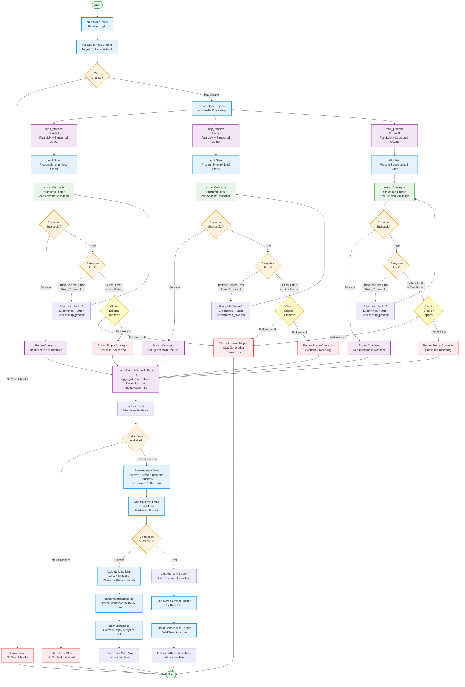

# MindMapGraph Agent Flowchart

This flowchart visualizes the execution flow of the MindMapGraph agent, which generates hierarchical mind maps from educational content through a map-reduce pattern with structured concept extraction.

## Flow Diagram



## Key Components

### 1. **Fan-Out Logic** (`createMapTasks`)
- Validates and packs chunks (target: 15K chars/chunk)
- Creates Send objects for parallel processing
- Returns error if no valid chunks after validation

### 2. **Map Phase** (`mapProcess`) - Parallel Execution
- Processes each chunk independently using Fast LLM
- **Jitter Addition**: Prevents synchronized starts
  - First attempt: Random 0-500ms jitter
  - Retries: Exponential backoff + jitter
- **Structured Output** with Zod schema validation:
  - `ConceptExtractionSchema`: Validates extraction structure
  - Extracts: main_theme, summary, key_concepts (15 concepts)
- **Error Handling**:
  - Retries on timeout/server errors (500, 503)
  - Max 3 attempts per chunk
  - Exponential backoff with jitter
  - Fails fast on client errors
- **Circuit Breaker**:
  - Tracks total permanent failures across all chunks
  - Trips after 5 failures
  - Stops entire generation to prevent cascading failures
- Returns extracted concepts (or empty array on permanent failure)

### 3. **Automatic Fan-In** (LangGraph Reducer)
- LangGraph automatically waits for all map nodes to complete
- Aggregates results via reducer
- **Deduplication**:
  - Uses theme + summary as unique key
  - Filters duplicate extractions
  - Logs skipped duplicates

### 4. **Reduce Phase** (`reduceNode`)
- Synthesizes mind map from extracted concepts
- **Input Preparation**:
  - Formats extractions as: "THEME: ... SUMMARY: ... CONCEPTS: ..."
  - Truncates to 150K chars for safety
- **Markdown Generation**:
  - Uses Smart LLM to generate hierarchical markdown
  - Format: # Root, * branches, indented sub-topics
  - Validates output structure
- **Markdown Parsing**:
  - Parses markdown to JSON tree structure
  - Supports: # headers, *, -, numbered bullets
  - Handles 2-space or 4-space indentation
  - Converts empty children arrays to null
- **Smart Fallback** (if LLM fails):
  - Finds most common theme for root title
  - Groups concepts by theme
  - Builds tree structure without generic labels
  - Avoids "Aspect" or "Category" buckets

## State Management

The agent uses two state types:

### `OverallState`
- `allChunks`: Input document chunks
- `extractedConcepts`: Array of concept extractions (with deduplication reducer)
- `finalOutput`: Final mind map tree structure
- `status`: Current processing status
- `progress`: Progress tracking for streaming

### `ChunkState` (for map processing)
- `content`: Chunk content to process
- `retryCount`: Current retry attempt
- `chunkIndex`: Index of chunk (for progress tracking)
- `totalChunks`: Total number of chunks

## Concept Extraction Schema

Each extraction follows the `ConceptExtraction` interface:
```typescript
{
  main_theme: string;      // Single sentence (max 15 words)
  summary: string;         // 2-3 sentences (50-100 words)
  key_concepts: string[];  // Exactly 15 distinct concepts
}
```

## Mind Map Structure

The final output is a hierarchical tree:
```typescript
{
  nodeData: {
    topic: string;           // Node topic
    children: MindMapNode[] | null;  // Child nodes or null for leaves
  }
}
```

### Markdown Format Requirements
- **Level 0 (Root)**: `# Single overarching topic`
- **Level 1**: `* Main branches` (2-space indent, 4-7 branches)
- **Level 2**: `  * Sub-topics` (4-space indent, 3-5 per branch)
- **Level 3-4**: `    * Granular concepts` (6-8 space indent)

## Key Features

### Structured Output
- Uses Zod schemas for reliable concept extraction
- Ensures consistent format across all extractions
- Validates at extraction time

### Deduplication
- Uses theme + summary as unique key
- Prevents duplicate extractions from different chunks
- Logs skipped duplicates for visibility

### Circuit Breaker Pattern
- Prevents cascading failures
- Tracks total failures across all chunks
- Stops generation after 5 permanent failures
- Resets on successful extraction

### Retry Logic
- Exponential backoff with jitter
- Retries only on timeout/server errors (500, 503)
- Fails fast on client errors
- Max 3 attempts per chunk

### Jitter Strategy
- Prevents thundering herd problem
- Random delay on first attempt (0-500ms)
- Exponential backoff + jitter on retries
- Reduces synchronized load spikes

### Grounding Requirements
- **Map Phase**: Only extracts concepts explicitly stated in content
- **Reduce Phase**: Only uses concepts from extracted data
- No generic labels like "Overview", "Introduction", "Conclusion"
- Each terminal node must be a specific concept from source

### Smart Fallback
- Creates meaningful tree if LLM fails
- Uses most common theme for root
- Groups concepts by theme
- Avoids generic category labels
- Ensures generation always completes

### Markdown Parsing
- Robust parser supporting multiple formats
- Handles # headers, *, -, numbered bullets
- Normalizes tabs to spaces
- Calculates indentation levels
- Builds proper tree structure
- Cleans empty children arrays

## Error Handling

### Map Phase Errors
- **Timeout Errors**: Retry with backoff
- **Server Errors (500, 503)**: Retry with backoff
- **Client Errors**: Fail fast, no retry
- **Circuit Breaker**: Stop after 5 failures

### Reduce Phase Errors
- **LLM Failure**: Use smart fallback
- **No Extractions**: Return error state
- **Validation Issues**: Log warnings, continue

## Performance Optimizations

- **Parallel Processing**: Map phase processes chunks concurrently
- **No Collapse Phase**: Simpler than ReportGraph (direct aggregation)
- **Structured Output**: Reduces parsing errors
- **Jitter**: Prevents synchronized load spikes
- **Circuit Breaker**: Prevents resource waste on failures
- **Input Truncation**: Limits reduce phase input to 150K chars

## Validation

The mind map output is validated for:
- **Structure**: Minimum 4 levels deep (if supported by content)
- **Generic Labels**: No "Overview", "Introduction", "Conclusion", "Aspect", "Category"
- **Terminal Nodes**: Must be specific concepts, not categories
- **Format**: Proper markdown hierarchy

## Differences from Other Agents

### vs ReportGraph
- **Simpler**: No collapse phase, direct aggregation
- **Structured Output**: Uses Zod schemas for extraction
- **Different Output**: Tree structure vs text report

### vs QuizGraph
- **No Question Selection**: Direct aggregation of concepts
- **Tree Structure**: Hierarchical mind map vs flat question array
- **Markdown Parsing**: Converts markdown to JSON tree
