# QuizGraph Agent Flowchart

This flowchart visualizes the execution flow of the QuizGraph agent, which generates multiple-choice quiz questions from educational content through a map-reduce pattern with structured output.

## Flow Diagram

```mermaid
flowchart TD
    START([Start]) --> SplitChunks[split_chunks<br/>Prepare Chunks]

    SplitChunks --> RouteToMap[routeToMap<br/>Route to Map Phase]

    RouteToMap --> CheckChunks{Chunks<br/>Available?}

    CheckChunks -->|No Chunks| Collapse1[collapse<br/>Skip to Collapse]
    CheckChunks -->|Has Chunks| ValidateChunks[Validate & Pack Chunks<br/>Target: 20K chars/chunk]

    ValidateChunks --> CalculateQuestions[Calculate Questions per Chunk<br/>Buffer: 1.5x, Max: 25/chunk]

    CalculateQuestions --> FanOut[Fan-Out: Create Send Objects<br/>for Parallel Processing]

    FanOut --> MapProcess1[map_process<br/>Chunk 1<br/>Fast LLM + Structured Output]
    FanOut --> MapProcess2[map_process<br/>Chunk 2<br/>Fast LLM + Structured Output]
    FanOut --> MapProcessN[map_process<br/>Chunk N<br/>Fast LLM + Structured Output]

    MapProcess1 --> GenerateQuestions1[Generate Questions<br/>Zod Schema Validation<br/>JSON Array Output]
    MapProcess2 --> GenerateQuestions2[Generate Questions<br/>Zod Schema Validation<br/>JSON Array Output]
    MapProcessN --> GenerateQuestionsN[Generate Questions<br/>Zod Schema Validation<br/>JSON Array Output]

    GenerateQuestions1 --> CollectMapOutputs[Collect All Map Outputs<br/>JSON Arrays of Questions]
    GenerateQuestions2 --> CollectMapOutputs
    GenerateQuestionsN --> CollectMapOutputs

    CollectMapOutputs --> Collapse2[collapse<br/>Collapse Phase]
    Collapse1 --> Collapse2

    Collapse2 --> ParseQuestions[Parse All Question Arrays<br/>Count Total Questions]

    ParseQuestions --> CheckSize{Estimated Size<br/>> Reduce Chunk Size?}

    CheckSize -->|No| SkipCollapse[Skip Recursive Collapse<br/>Use Map Outputs Directly]
    CheckSize -->|Yes| RecursiveCollapse[recursiveCollapse<br/>Merge Question Arrays]

    RecursiveCollapse --> CollapseGroup1[collapseGroup<br/>Group 1<br/>Merge JSON Arrays]
    RecursiveCollapse --> CollapseGroup2[collapseGroup<br/>Group 2<br/>Merge JSON Arrays]
    RecursiveCollapse --> CollapseGroupM[collapseGroup<br/>Group M<br/>Merge JSON Arrays]

    CollapseGroup1 --> CheckRecursiveSize{Still<br/>Too Large?}
    CollapseGroup2 --> CheckRecursiveSize
    CollapseGroupM --> CheckRecursiveSize

    CheckRecursiveSize -->|Yes| RecursiveCollapse
    CheckRecursiveSize -->|No| Reduce[reduce<br/>Final Selection]

    SkipCollapse --> Reduce

    Reduce --> ParseAllQuestions[Parse All Question Arrays<br/>from Collapsed Outputs]

    ParseAllQuestions --> CheckQuestionCount{Questions<br/>Generated?}

    CheckQuestionCount -->|No Questions| Fail[Return Failed State<br/>No Questions Generated]
    CheckQuestionCount -->|Has Questions| CheckCount{Total Questions<br/>> Target Count?}

    CheckCount -->|Fewer| SkipLLM[Skip LLM Selection<br/>Use All Questions Directly]
    CheckCount -->|More| DetectSimilar[Detect Similar Questions<br/>Word Overlap Analysis]

    DetectSimilar --> LLMSelection[Smart LLM Selection<br/>Structured Output<br/>Merge Duplicates]

    LLMSelection --> ValidateSelection{Selection<br/>Successful?}

    ValidateSelection -->|Success| FinalizeQuestions[finalizeQuestions<br/>Validate & Finalize]
    ValidateSelection -->|Failed| CheckRetry{Retry<br/>Count < 1?}

    CheckRetry -->|Yes| RetryReduce[Retry Reduce Phase<br/>Send to reduce]
    CheckRetry -->|No| FallbackSlice[Fallback: Simple Slice<br/>Take First N Questions]

    RetryReduce --> LLMSelection
    FallbackSlice --> FinalizeQuestions
    SkipLLM --> FinalizeQuestions

    FinalizeQuestions --> ValidateQuiz[Validate Quiz Quality<br/>Check Answer Indices<br/>Check Explanation Length]

    ValidateQuiz --> MergeResults[Return Final State<br/>Status: completed]

    Fail --> END([End])
    MergeResults --> END

    %% Styling
    classDef startEnd fill:#e1f5e1,stroke:#4caf50,stroke-width:2px
    classDef process fill:#e3f2fd,stroke:#2196f3,stroke-width:2px
    classDef decision fill:#fff3e0,stroke:#ff9800,stroke-width:2px
    classDef parallel fill:#f3e5f5,stroke:#9c27b0,stroke-width:2px
    classDef error fill:#ffebee,stroke:#f44336,stroke-width:2px
    classDef structured fill:#e8f5e9,stroke:#66bb6a,stroke-width:2px

    class START,END startEnd
    class SplitChunks,RouteToMap,ValidateChunks,CalculateQuestions,Collapse2,ParseQuestions,RecursiveCollapse,Reduce,ParseAllQuestions,DetectSimilar,FinalizeQuestions,ValidateQuiz,MergeResults process
    class CheckChunks,CheckSize,CheckRecursiveSize,CheckQuestionCount,CheckCount,ValidateSelection,CheckRetry decision
    class MapProcess1,MapProcess2,MapProcessN,GenerateQuestions1,GenerateQuestions2,GenerateQuestionsN,CollectMapOutputs,CollapseGroup1,CollapseGroup2,CollapseGroupM parallel
    class Fail,RetryReduce,FallbackSlice error
    class GenerateQuestions1,GenerateQuestions2,GenerateQuestionsN,LLMSelection structured
```



## Key Components

### 1. **Split Chunks** (`split_chunks`)

- Initial preparation phase
- Logs input parameters (document count, question count, difficulty, focus)
- Sets initial progress state

### 2. **Routing** (`routeToMap`)

- Validates and packs chunks (target: 20K chars/chunk)
- Calculates questions per chunk:
  - Uses buffer multiplier (1.5x) to account for LLM variability
  - Maximum 25 questions per chunk (LLM limit)
  - Minimum 3 questions per chunk
- Creates Send objects for parallel processing or routes to collapse

### 3. **Map Phase** (`map_process`) - Parallel Execution

- Processes each chunk independently using Fast LLM
- **Uses Structured Output** with Zod schema validation:
  - `QuizQuestionSchema`: Validates question structure
  - Ensures exactly 4 options per question
  - Validates answer index (0-3)
  - Requires hint and explanation
- Generates questions based on:
  - **Difficulty**: easy (recall), medium (understanding), hard (analysis)
  - **Focus**: Optional topic focus area
  - **Questions per chunk**: Calculated target count
- Returns JSON array of questions
- Includes error handling with fallback to empty array

### 4. **Collapse Phase** (`collapse`)

- Parses all question arrays from map outputs
- Checks if total size exceeds reduce chunk size (40K chars)
- **Recursive Collapse** (if needed):
  - Groups question arrays by token count
  - Merges JSON arrays (no LLM synthesis)
  - Recursively collapses until size is manageable
  - Has depth limit (MAX_COLLAPSE_DEPTH: 5) to prevent infinite loops
- If size is acceptable, skips collapse and uses map outputs directly

### 5. **Reduce Phase** (`reduce`)

- Parses all question arrays from collapsed outputs
- **Conditional LLM Selection**:
  - If fewer questions than target → Skip LLM (would hallucinate)
  - If more questions than target → Use Smart LLM for intelligent selection
- **LLM Selection Process**:
  - Detects similar questions using word overlap analysis
  - Uses Smart LLM with structured output to:
    - Merge duplicate/similar questions
    - Select diverse questions (semantic diversity)
    - Ensure quality over quantity
    - Maintain target count (±20% acceptable)
  - Includes retry logic (max 2 attempts)
  - Falls back to simple slice if LLM fails
- **Finalization**:
  - Validates answer indices (0-3)
  - Checks explanation length (minimum 20 chars)
  - Validates overall quiz quality
  - Logs final question count

## State Management

The agent uses `OverallState` with the following key fields:

- `chunks`: Input document chunks
- `questionCount`: Target number of questions (default: 20)
- `difficulty`: Question difficulty level (easy/medium/hard)
- `focus`: Optional topic focus area
- `mapOutputs`: JSON arrays of questions from parallel processing
- `collapsedOutputs`: Merged question arrays from collapse phase
- `finalOutput`: Final array of selected questions
- `status`: Current processing status
- `progress`: Progress tracking for streaming
- `reduceRetryCount`: Retry counter for reduce phase

## Question Schema

Each question follows the `QuizQuestion` interface:

```typescript
{
  question: string;        // Complete question text
  options: string[];        // Exactly 4 options
  answer: number;           // 0-based index (0-3)
  hint: string;             // Helpful hint (doesn't reveal answer)
  explanation: string;     // Grounded explanation from source material
}
```

## Key Features

### Structured Output

- Uses Zod schemas for reliable question generation
- Ensures consistent format across all questions
- Validates at generation time, not post-processing

### Duplicate Detection

- Word overlap analysis (>70% shared words)
- LLM merges similar questions during selection
- Ensures semantic diversity in final quiz

### Intelligent Selection

- Smart LLM selects questions based on:
  - Semantic diversity
  - Quality over quantity
  - Difficulty level
  - Focus area (if specified)
- Merges duplicates before selection
- Flexible count (±20% of target acceptable)

### Error Handling

- **Timeout Protection**: Map (180s), Reduce (240s)
- **Retry Logic**: Exponential backoff for transient failures
- **Fallback Strategies**:
  - Empty array on map failure
  - Simple slice on reduce failure
  - Retry reduce phase once before fallback
- **Validation**: Answer indices, explanation length, quiz quality

### Self-Contained Questions

- Questions must include all necessary context
- No vague references to "the diagram" or "the following"
- Example: "In the ER diagram with Entities A(id) and B(id)..." instead of "In the diagram shown..."

### Grounded Explanations

- Explanations must reference source material
- No hallucination or outside knowledge
- Format: "According to the text, [concept]..." or "The material states that..."

## Performance Optimizations

- **Parallel Processing**: Map phase processes chunks concurrently
- **Recursive Collapse**: Efficiently handles large numbers of questions
- **Conditional LLM**: Skips LLM when not needed (fewer questions than target)
- **Structured Output**: Reduces parsing errors and validation overhead
- **Depth Limiting**: Prevents infinite collapse recursion

## Difficulty Levels

1. **Easy**: Basic recall and definitions - straightforward facts
2. **Medium**: Concepts and relationships - requires understanding
3. **Hard**: Application and analysis - requires deeper thinking

## Answer Format

- **Critical**: Answer field is a NUMBER (0-3), not letters (A, B, C, D)
- Option indices: 0 = first, 1 = second, 2 = third, 3 = fourth
- Validated during finalization to ensure correct format
