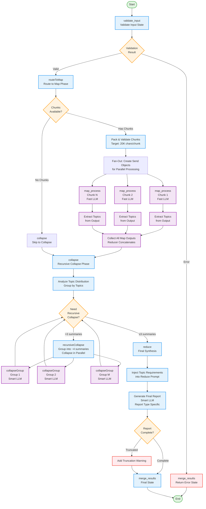

# ReportGraph Agent Flowchart

This flowchart visualizes the execution flow of the ReportGraph agent, which processes documents through a map-reduce pattern to generate various types of reports.

## Flow Diagram

## Key Components

### 1. **Input Validation** (`validate_input`)
- Validates chunks, report type, and custom prompts
- Returns error state if validation fails

### 2. **Routing** (`routeToMap`)
- Checks if chunks are available
- Packs and validates chunks (target: 20K chars/chunk)
- Creates Send objects for parallel processing or routes to collapse

### 3. **Map Phase** (`map_process`) - Parallel Execution
- Processes each chunk independently using Fast LLM
- Extracts topics, insights, and structured content
- Report type determines the extraction format:
  - `briefing`: Insights, themes, evidence, action items
  - `study_guide`: Learning objectives, concepts, quiz questions
  - `blog_post`: Takeaways, quotes, actionable advice
  - `summary`: Arguments, evidence, conclusions
  - `technical_report`: Specifications, methodologies, metrics
  - `concept_explainer`: Concepts, relationships, examples
  - `methodology_overview`: Methods, frameworks, data collection
  - `custom`: User-defined prompt

### 4. **Collapse Phase** (`collapse`)
- Recursively collapses map outputs if >3 summaries
- Groups summaries (~4 per group) and collapses in parallel
- Preserves structured format with "Main Topics:" sections
- Uses Smart LLM for quality synthesis

### 5. **Reduce Phase** (`reduce`)
- Final synthesis of collapsed outputs
- Injects explicit topic coverage requirements
- Generates report type-specific output
- Validates completeness and detects truncation
- Uses Smart LLM with higher token limits

### 6. **Merge Results** (`merge_results`)
- Final state update
- Marks status as 'completed'
- Returns final output

## State Management

The agent uses `OverallState` with the following key fields:
- `chunks`: Input document chunks
- `reportType`: Type of report to generate
- `customPrompt`: Optional custom prompt
- `mapOutputs`: Results from parallel map processing
- `collapsedOutputs`: Synthesized outputs from collapse phase
- `finalOutput`: Final generated report
- `status`: Current processing status
- `progress`: Progress tracking for streaming

## Error Handling

- **Timeout Protection**: Each phase has timeout limits (Map: 200s, Reduce: 300s)
- **Retry Logic**: Exponential backoff retry for transient failures
- **Fallback Outputs**: Error chunks return fallback content to continue processing
- **Truncation Detection**: Validates report completeness and warns if truncated

## Performance Optimizations

- **Parallel Processing**: Map phase processes chunks concurrently
- **Recursive Collapse**: Efficiently handles large numbers of map outputs
- **Topic Caching**: Caches extracted topics for performance
- **Dynamic Grouping**: Optimizes collapse group sizes based on content

## Report Types Supported

1. **briefing**: Executive summaries with themes and recommendations
2. **study_guide**: Learning materials with quizzes and glossaries
3. **blog_post**: Engaging listicles with takeaways
4. **summary**: Concise information synthesis
5. **technical_report**: Detailed technical documentation
6. **concept_explainer**: Accessible concept explanations
7. **methodology_overview**: Research method documentation
8. **custom**: User-defined report format
