# WrittenQuestionsGraph Agent Flowchart

This flowchart visualizes the execution flow of the WrittenQuestionsGraph agent, which generates written assessment questions (short-answer and essay) from educational content through a map-reduce pattern with structured output.

## Flow Diagram

```mermaid
flowchart TD
    START([Start]) --> SplitChunks[split_chunks<br/>Validate & Pack Chunks]
    
    SplitChunks --> RouteToMap[routeToMap<br/>Route to Map Phase]
    
    RouteToMap --> CheckChunks{Chunks<br/>Available?}
    
    CheckChunks -->|No Chunks| Collapse1[collapse<br/>Skip to Collapse]
    CheckChunks -->|Has Chunks| CalculateQuestions[Calculate Questions per Chunk<br/>Buffer: 1.5x, Max: 25/chunk]
    
    CalculateQuestions --> FanOut[Fan-Out: Create Send Objects<br/>for Parallel Processing]
    
    FanOut --> MapProcess1[map_process<br/>Chunk 1<br/>Fast LLM + Structured Output]
    FanOut --> MapProcess2[map_process<br/>Chunk 2<br/>Fast LLM + Structured Output]
    FanOut --> MapProcessN[map_process<br/>Chunk N<br/>Fast LLM + Structured Output]
    
    MapProcess1 --> CheckRetry1{Retry<br/>Count > 0?}
    MapProcess2 --> CheckRetry2{Retry<br/>Count > 0?}
    MapProcessN --> CheckRetryN{Retry<br/>Count > 0?}
    
    CheckRetry1 -->|Yes| Backoff1[Exponential Backoff + Jitter<br/>Prevent Thundering Herd]
    CheckRetry1 -->|No| GenerateQuestions1[Generate Questions<br/>Zod Schema Validation<br/>JSON Array Output]
    CheckRetry2 -->|Yes| Backoff2[Exponential Backoff + Jitter<br/>Prevent Thundering Herd]
    CheckRetry2 -->|No| GenerateQuestions2[Generate Questions<br/>Zod Schema Validation<br/>JSON Array Output]
    CheckRetryN -->|Yes| BackoffN[Exponential Backoff + Jitter<br/>Prevent Thundering Herd]
    CheckRetryN -->|No| GenerateQuestionsN[Generate Questions<br/>Zod Schema Validation<br/>JSON Array Output]
    
    Backoff1 --> GenerateQuestions1
    Backoff2 --> GenerateQuestions2
    BackoffN --> GenerateQuestionsN
    
    GenerateQuestions1 --> ValidateSelfContained1[Validate Self-Contained<br/>Check for Problematic Phrases]
    GenerateQuestions2 --> ValidateSelfContained2[Validate Self-Contained<br/>Check for Problematic Phrases]
    GenerateQuestionsN --> ValidateSelfContainedN[Validate Self-Contained<br/>Check for Problematic Phrases]
    
    ValidateSelfContained1 --> EnforceTypes1[Enforce Question Type & Points<br/>Set IDs, questionType, maxPoints]
    ValidateSelfContained2 --> EnforceTypes2[Enforce Question Type & Points<br/>Set IDs, questionType, maxPoints]
    ValidateSelfContainedN --> EnforceTypesN[Enforce Question Type & Points<br/>Set IDs, questionType, maxPoints]
    
    EnforceTypes1 --> CheckError1{Generation<br/>Successful?}
    EnforceTypes2 --> CheckError2{Generation<br/>Successful?}
    EnforceTypesN --> CheckErrorN{Generation<br/>Successful?}
    
    CheckError1 -->|Success| CollectMapOutputs[Collect All Map Outputs<br/>JSON Arrays of Questions]
    CheckError1 -->|Error| RetryMap1{Retryable<br/>Error?}
    CheckError2 -->|Success| CollectMapOutputs
    CheckError2 -->|Error| RetryMap2{Retryable<br/>Error?}
    CheckErrorN -->|Success| CollectMapOutputs
    CheckErrorN -->|Error| RetryMapN{Retryable<br/>Error?}
    
    RetryMap1 -->|Yes| Retry1[Retry with Backoff<br/>Send to map_process]
    RetryMap2 -->|Yes| Retry2[Retry with Backoff<br/>Send to map_process]
    RetryMapN -->|Yes| RetryN[Retry with Backoff<br/>Send to map_process]
    
    Retry1 --> MapProcess1
    Retry2 --> MapProcess2
    RetryN --> MapProcessN
    
    RetryMap1 -->|No| ThrowError1[Throw Error<br/>Job-Level Retry]
    RetryMap2 -->|No| ThrowError2[Throw Error<br/>Job-Level Retry]
    RetryMapN -->|No| ThrowErrorN[Throw Error<br/>Job-Level Retry]
    
    CollectMapOutputs --> Collapse2[collapse<br/>Collapse Phase]
    Collapse1 --> Collapse2
    
    Collapse2 --> ParseAllQuestions[Parse All Question Arrays<br/>from Map Outputs]
    
    ParseAllQuestions --> CheckCoverage{Chunk Coverage<br/>>= 70%?}
    
    CheckCoverage -->|Low Coverage| WarnCoverage[Log Warning<br/>Low Chunk Coverage]
    CheckCoverage -->|Good Coverage| CheckAllFailed{All<br/>Failed?}
    WarnCoverage --> CheckAllFailed
    
    CheckAllFailed -->|Yes| ReturnError[Return Failed State<br/>No Questions Generated]
    CheckAllFailed -->|No| ConcatenateQuestions[Concatenate All Questions<br/>into Single Array]
    
    ConcatenateQuestions --> Reduce[reduce<br/>Final Selection]
    
    Reduce --> ParseCollapsed[Parse Questions<br/>from Collapsed Outputs]
    
    ParseCollapsed --> CheckQuestionCount{Questions<br/>Generated?}
    
    CheckQuestionCount -->|No Questions| ReturnFailed[Return Failed State<br/>No Questions]
    CheckQuestionCount -->|Has Questions| CheckCount{Total Questions<br/>> Target Count?}
    
    CheckCount -->|Fewer or Equal| SkipLLM[Skip LLM Selection<br/>Use All Questions Directly]
    CheckCount -->|More| DetectSimilar[Detect Similar Questions<br/>Word Overlap Analysis]
    
    DetectSimilar --> LLMSelection[Smart LLM Selection<br/>Structured Output<br/>Merge Duplicates]
    
    LLMSelection --> ValidateSelection{Selection<br/>Successful?}
    
    ValidateSelection -->|Success| FinalizeQuestions[finalizeQuestions<br/>Enforce Types & IDs]
    ValidateSelection -->|Failed| CheckRetryReduce{Retry<br/>Count < 1?}
    
    CheckRetryReduce -->|Yes| RetryReduce[Retry Reduce Phase<br/>Send to reduce]
    CheckRetryReduce -->|No| FallbackSlice[Fallback: Simple Slice<br/>Take First N Questions]
    
    RetryReduce --> LLMSelection
    FallbackSlice --> FinalizeQuestions
    SkipLLM --> FinalizeQuestions
    
    FinalizeQuestions --> ReturnSuccess[Return Final State<br/>Status: completed]
    
    ReturnError --> END([End])
    ReturnFailed --> END
    ReturnSuccess --> END
    ThrowError1 --> END
    ThrowError2 --> END
    ThrowErrorN --> END
    
    %% Styling
    classDef startEnd fill:#e1f5e1,stroke:#4caf50,stroke-width:2px
    classDef process fill:#e3f2fd,stroke:#2196f3,stroke-width:2px
    classDef decision fill:#fff3e0,stroke:#ff9800,stroke-width:2px
    classDef parallel fill:#f3e5f5,stroke:#9c27b0,stroke-width:2px
    classDef error fill:#ffebee,stroke:#f44336,stroke-width:2px
    classDef structured fill:#e8f5e9,stroke:#66bb6a,stroke-width:2px
    classDef validation fill:#fff3e0,stroke:#ff9800,stroke-width:2px
    
    class START,END startEnd
    class SplitChunks,RouteToMap,CalculateQuestions,Collapse2,ParseAllQuestions,ConcatenateQuestions,Reduce,ParseCollapsed,DetectSimilar,FinalizeQuestions process
    class CheckChunks,CheckRetry1,CheckRetry2,CheckRetryN,CheckError1,CheckError2,CheckErrorN,RetryMap1,RetryMap2,RetryMapN,CheckCoverage,CheckAllFailed,CheckQuestionCount,CheckCount,ValidateSelection,CheckRetryReduce decision
    class MapProcess1,MapProcess2,MapProcessN,GenerateQuestions1,GenerateQuestions2,GenerateQuestionsN,ValidateSelfContained1,ValidateSelfContained2,ValidateSelfContainedN,EnforceTypes1,EnforceTypes2,EnforceTypesN,CollectMapOutputs,LLMSelection parallel
    class ReturnError,ReturnFailed,ThrowError1,ThrowError2,ThrowErrorN,Retry1,Retry2,RetryN,FallbackSlice error
    class GenerateQuestions1,GenerateQuestions2,GenerateQuestionsN,LLMSelection structured
    class ValidateSelfContained1,ValidateSelfContained2,ValidateSelfContained3,EnforceTypes1,EnforceTypes2,EnforceTypesN validation
```



## Key Components

### 1. **Split Chunks** (`split_chunks`)
- Validates and packs chunks (target: 80K chars/chunk)
- Updates state with packed chunks
- Sets initial progress state

### 2. **Routing** (`routeToMap`)
- Uses already-packed chunks from split_chunks
- Calculates questions per chunk:
  - Uses buffer multiplier (1.5x) to account for LLM variability
  - Maximum 25 questions per chunk (LLM limit)
  - Minimum 2 questions per chunk
- Creates Send objects for parallel processing or routes to collapse

### 3. **Map Phase** (`mapProcess`) - Parallel Execution
- Processes each chunk independently using Fast LLM
- **Retry Logic**:
  - Exponential backoff with jitter on retries
  - Prevents thundering herd problem
- **Structured Output** with Zod schema validation:
  - `WrittenQuestionSchema`: Validates question structure
  - Ensures: id, question, questionType, rubric (maxPoints, criteria), modelAnswer
- **Self-Contained Validation**:
  - Checks for problematic phrases: "the diagram", "the above", "as shown", etc.
  - Accepts questions with embedded context indicators
  - Rejects questions referencing external content without context
- **Type Enforcement**:
  - Sets questionType from state (never trusts LLM)
  - Enforces point values: 5 for short, 12 for essay
  - Generates UUIDs for questions without IDs
- Returns JSON array of validated questions
- Throws errors for job-level retry (not handled internally)

### 4. **Collapse Phase** (`collapse`)
- Parses all question arrays from map outputs
- **Chunk Coverage Tracking**:
  - Calculates successful chunks vs total chunks
  - Warns if coverage < 70% threshold
  - Tracks empty chunks and parse failures
- **Error Handling**:
  - Returns failed state if all chunks fail
  - Continues with partial success if some chunks succeed
  - Logs parse errors for visibility
- Concatenates all questions into single array
- Ensures all questions have valid IDs and correct types

### 5. **Reduce Phase** (`reduce`)
- Parses all questions from collapsed outputs
- **Conditional LLM Selection**:
  - If fewer or equal to target → Skip LLM (use all questions)
  - If more than target → Use Smart LLM for intelligent selection
- **LLM Selection Process**:
  - Detects similar questions using word overlap analysis
  - Groups questions by topic for better selection
  - Uses Smart LLM with structured output to:
    - Merge duplicate/similar questions
    - Select diverse questions (semantic diversity)
    - Ensure quality over quantity
    - Maintain target count (±20% acceptable)
  - Includes retry logic (max 2 attempts)
  - Falls back to simple slice if LLM fails
- **Finalization**:
  - Enforces questionType from state
  - Ensures all questions have valid IDs
  - Logs final question count and details

## State Management

The agent uses `OverallState` with the following key fields:
- `chunks`: Input document chunks (packed)
- `questionCount`: Target number of questions (default: 10)
- `difficulty`: Question difficulty level (easy/medium/hard)
- `questionType`: Type of questions ('short' | 'essay')
- `focus`: Optional topic focus area
- `mapOutputs`: JSON arrays of questions from parallel processing
- `collapsedOutputs`: Concatenated question array from collapse phase
- `finalOutput`: Final array of selected questions
- `status`: Current processing status
- `progress`: Progress tracking for streaming
- `reduceRetryCount`: Retry counter for reduce phase

## Question Schema

Each question follows the `WrittenQuestion` interface:
```typescript
{
  id: string;                    // Unique identifier (UUID)
  question: string;               // Complete question text
  questionType: 'short' | 'essay'; // Question type
  rubric: {
    maxPoints: number;            // 5 for short, 12 for essay
    criteria: string[];            // Grading criteria
  };
  modelAnswer: string | null;     // Optional model answer
}
```

## Key Features

### Structured Output
- Uses Zod schemas for reliable question generation
- Ensures consistent format across all questions
- Validates at generation time, not post-processing

### Self-Contained Validation
- Checks for problematic phrases indicating external references:
  - "the diagram", "the above", "as shown", "this chart", etc.
- Accepts questions with embedded context:
  - "as shown in", "given that", "in the following", etc.
  - Questions > 200 chars (likely have context)
- Rejects questions referencing external content without context

### Type Enforcement
- **Question Type**: Always set from state, never trusts LLM
- **Point Values**: Enforced based on type (5 for short, 12 for essay)
- **IDs**: Generates UUIDs for questions without valid IDs

### Chunk Coverage Tracking
- Monitors successful chunks vs total chunks
- Warns if coverage < 70% threshold
- Tracks empty chunks and parse failures
- Returns failed state if all chunks fail

### Duplicate Detection
- Word overlap analysis (>70% shared words)
- LLM merges similar questions during selection
- Ensures semantic diversity in final question set

### Intelligent Selection
- Smart LLM selects questions based on:
  - Semantic diversity
  - Quality over quantity
  - Difficulty level
  - Question type
  - Focus area (if specified)
- Groups questions by topic for better selection
- Merges duplicates before selection
- Flexible count (±20% of target acceptable)

### Retry Logic
- **Map Phase**: Exponential backoff with jitter
- **Reduce Phase**: Max 2 attempts with retry counter
- **Job-Level**: Throws errors for external retry handling

### Topic Extraction
- Sophisticated pattern matching for topic classification:
  - Comparisons, Analysis, Explanations
  - Processes, Timeline/Dates, People, Places
  - Causes/Reasons, Definitions, Classification, Facts
- Groups questions by topic for LLM selection

## Error Handling

### Map Phase Errors
- **Retryable Errors**: Retry with exponential backoff
- **Non-Retryable Errors**: Throw for job-level retry
- **Validation Errors**: Filter out invalid questions, continue

### Collapse Phase Errors
- **Parse Errors**: Log and skip, continue with valid questions
- **All Failed**: Return failed state
- **Low Coverage**: Warn but continue

### Reduce Phase Errors
- **LLM Failure**: Retry once, then fallback to simple slice
- **No Questions**: Return failed state
- **Selection Issues**: Accept LLM result even if count differs

## Performance Optimizations

- **Parallel Processing**: Map phase processes chunks concurrently
- **No Recursive Collapse**: Direct concatenation (simpler than ReportGraph)
- **Conditional LLM**: Skips LLM when not needed (fewer questions than target)
- **Structured Output**: Reduces parsing errors and validation overhead
- **Jitter**: Prevents synchronized load spikes

## Question Types

### Short-Answer Questions
- **Point Value**: 5 points
- **Length**: Answerable in 1-3 sentences
- **Format**: Single, direct question (not a list of tasks)
- **Focus**: Basic recall and understanding

### Essay Questions
- **Point Value**: 12 points
- **Length**: Answerable in multiple paragraphs
- **Format**: Substantive questions requiring analysis
- **Focus**: Analysis, synthesis, and critical thinking

## Difficulty Levels

1. **Easy**: Basic recall and definitions - straightforward facts
2. **Medium**: Concepts and relationships - requires understanding
3. **Hard**: Application and analysis - requires deeper thinking

## Differences from Other Agents

### vs QuizGraph
- **Question Format**: Written questions vs multiple-choice
- **Point Values**: Enforced (5/12) vs fixed (not applicable)
- **Self-Contained Validation**: More strict checking for external references
- **Chunk Coverage**: Tracks and warns on low coverage

### vs ReportGraph
- **Output Type**: Question array vs text report
- **No Collapse Synthesis**: Direct concatenation vs recursive collapse
- **Type Enforcement**: Strict enforcement of question type and points

### vs MindMapGraph
- **Output Structure**: Flat question array vs hierarchical tree
- **Validation**: Self-contained checking vs concept extraction validation
- **Selection Logic**: LLM-based selection vs direct aggregation
